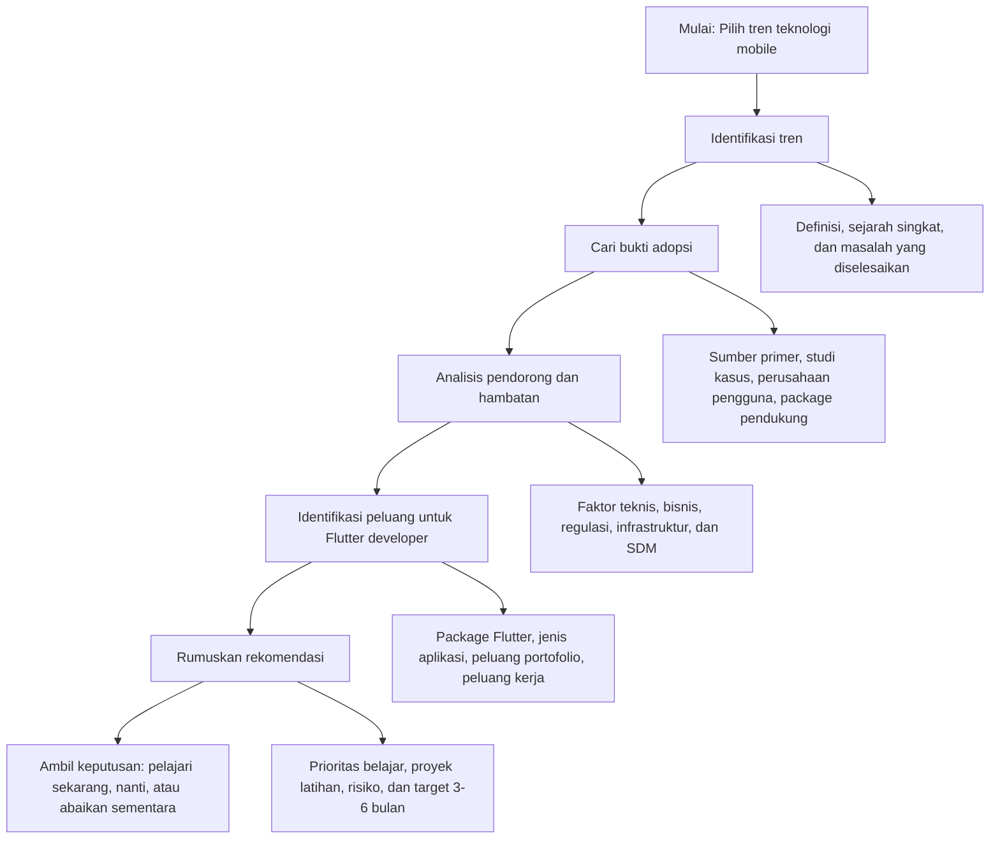
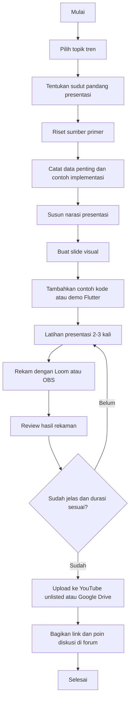
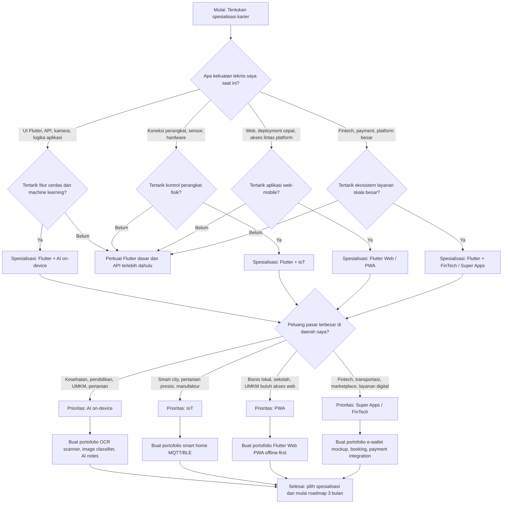

# Diagram_Algoritma_P15_23343082_RendiAigoBrandon

Dokumen ini berisi diagram untuk tugas **Aktivitas Algoritma - Kerangka Analisis Tren, Persiapan Future Tech Talk, dan Pohon Keputusan Karier**.

---

## 1. Diagram Kerangka Analisis Tren

---

## 2. Diagram Algoritma Persiapan Future Tech Talk

---

## 3. Diagram Pohon Keputusan Karier

