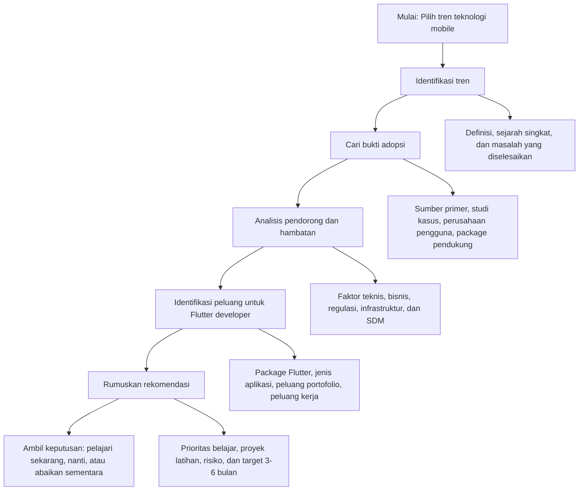
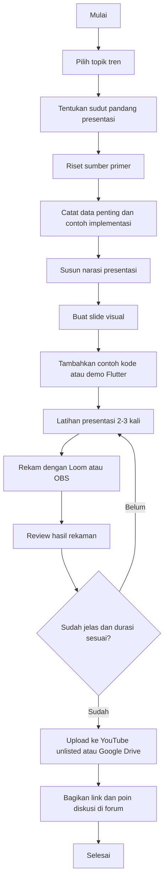
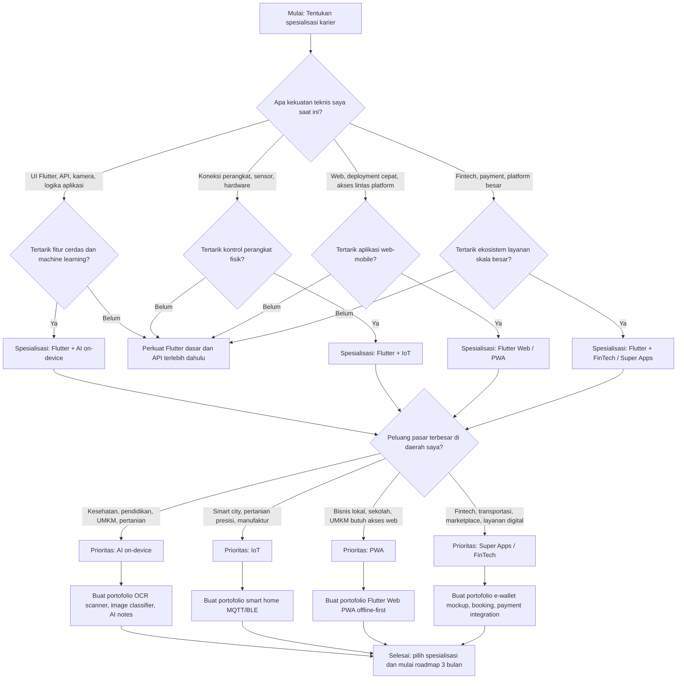

# Algoritma_P15_23343082_RendiAigoBrandon

## Aktivitas Algoritma  
### Kerangka Analisis Tren, Persiapan Future Tech Talk, dan Pohon Keputusan Karier

**Nama:** Rendi Aigo Brandon  
**NIM:** 23343082  
**Mata Kuliah:** Mobile Programming Lanjutan  
**Pertemuan:** 15  
**Topik:** Tren Terkini Mobile Computing  
**Tren Contoh yang Dianalisis:** AI on-device  
**Format Dokumentasi:** GitHub README.md / Notion / Google Docs  

---

## 1. Pendahuluan

Aktivitas algoritma bertujuan menyusun langkah sistematis yang dapat digunakan berulang untuk menganalisis tren teknologi mobile, mempersiapkan presentasi Future Tech Talk, dan menentukan spesialisasi karier sebagai developer. Dalam tugas ini, pendekatan algoritmik digunakan agar proses berpikir tidak hanya bersifat deskriptif, tetapi memiliki urutan yang jelas, dapat diuji, dan dapat diterapkan kembali pada tren lain seperti AI on-device, IoT, PWA, maupun Super Apps.

Tren yang digunakan sebagai contoh penerapan adalah **AI on-device**, karena tren ini sangat relevan dengan Flutter dan masa depan aplikasi mobile. AI on-device memungkinkan model kecerdasan buatan berjalan langsung di perangkat pengguna sehingga aplikasi dapat bekerja lebih cepat, lebih privat, dan tetap berguna saat koneksi internet terbatas.

---

## 2. Kerangka Analisis Tren yang Dapat Diulang

### 2.1 Tujuan Kerangka

Kerangka ini dirancang agar developer dapat mengevaluasi teknologi baru secara sistematis sebelum memutuskan apakah teknologi tersebut layak dipelajari, dijadikan proyek portofolio, atau dijadikan spesialisasi karier.

Kerangka ini dapat digunakan untuk berbagai tren mobile computing, misalnya:

- AI on-device
- Internet of Things atau IoT
- Progressive Web Apps atau PWA
- Super Apps
- Augmented Reality
- Wearable Apps
- Embedded Flutter

---

### 2.2 Reusable Framework Analisis Tren



---

### 2.3 Langkah Algoritmik Analisis Tren

| Langkah | Pertanyaan Utama | Output yang Diharapkan |
|---|---|---|
| 1. Identifikasi tren | Apa nama tren? Masalah apa yang diselesaikan? Siapa pengguna utamanya? | Deskripsi singkat tren dan alasan tren tersebut penting. |
| 2. Pencarian bukti adopsi | Apakah tren ini sudah digunakan oleh perusahaan, framework, atau komunitas developer? | Daftar bukti berupa produk, package, dokumentasi, atau studi kasus. |
| 3. Analisis pendorong | Faktor apa yang membuat tren ini berkembang? | Daftar kebutuhan pengguna, perkembangan hardware, peluang bisnis, atau perubahan perilaku pasar. |
| 4. Analisis hambatan | Apa kendala teknis, biaya, regulasi, dan infrastruktur? | Daftar risiko dan batasan adopsi. |
| 5. Peluang Flutter developer | Bagaimana Flutter dapat digunakan dalam tren ini? Package apa yang dibutuhkan? | Ide aplikasi, package, dan peluang portofolio. |
| 6. Rekomendasi | Apakah tren ini layak dipelajari sekarang? Apa langkah pertama yang harus dilakukan? | Keputusan prioritas dan rencana aksi. |

---

### 2.4 Pseudocode Kerangka Analisis Tren

```text
Mulai
    Pilih tren mobile computing
    Kumpulkan definisi dan konteks tren
    Cari bukti adopsi dari sumber primer dan studi kasus
    Jika bukti adopsi kuat:
        Analisis faktor pendorong tren
        Analisis hambatan adopsi tren
        Identifikasi hubungan tren dengan Flutter
        Tentukan peluang proyek dan karier
        Rumuskan rekomendasi belajar
    Jika bukti adopsi masih lemah:
        Tandai sebagai tren eksplorasi
        Pelajari secara ringan dan pantau perkembangannya
    Buat kesimpulan prioritas:
        Pelajari sekarang / pelajari nanti / abaikan sementara
Selesai
```

---

## 3. Contoh Penerapan Kerangka pada Tren AI On-Device

### 3.1 Identifikasi Tren

AI on-device adalah tren penerapan kecerdasan buatan yang dijalankan langsung di perangkat pengguna seperti smartphone, tablet, atau embedded device. Berbeda dengan AI berbasis cloud yang memerlukan koneksi internet dan server, AI on-device melakukan proses inferensi secara lokal di perangkat.

Masalah utama yang diselesaikan oleh tren ini adalah:

- Ketergantungan aplikasi pada koneksi internet.
- Latensi tinggi karena data harus dikirim ke server.
- Kekhawatiran privasi karena data pengguna dikirim keluar perangkat.
- Biaya operasional server yang meningkat jika jumlah pengguna besar.

AI on-device menjadi penting karena aplikasi mobile masa depan tidak hanya berfungsi sebagai tampilan, tetapi juga mampu memproses data, memahami konteks, dan membantu pengguna secara cerdas.

---

### 3.2 Pencarian Bukti Adopsi

Bukti adopsi AI on-device dapat dilihat dari beberapa hal:

| Bukti Adopsi | Penjelasan |
|---|---|
| TensorFlow Lite / LiteRT | Digunakan untuk menjalankan model machine learning yang ringan di perangkat mobile. |
| Google ML Kit | Menyediakan fitur siap pakai seperti OCR, barcode scanning, face detection, image labeling, dan translation. |
| MediaPipe LLM Inference | Mendukung eksperimen model bahasa yang dapat berjalan langsung di perangkat tertentu. |
| Package Flutter | Tersedia package seperti `tflite_flutter`, `google_mlkit_text_recognition`, `google_mlkit_barcode_scanning`, dan `camera`. |
| Fitur kamera cerdas | Banyak aplikasi modern menggunakan OCR, deteksi wajah, dan deteksi objek secara lokal. |
| Kebutuhan privasi | Sektor kesehatan, pendidikan, keuangan, dan identitas digital membutuhkan pemrosesan data yang lebih aman. |

---

### 3.3 Analisis Pendorong

Faktor yang mendorong berkembangnya AI on-device antara lain:

1. **Peningkatan kemampuan hardware mobile**  
   Smartphone modern memiliki CPU, GPU, dan NPU yang semakin kuat untuk menjalankan model AI.

2. **Kebutuhan privasi data**  
   Data seperti wajah, dokumen, kesehatan, dan aktivitas pengguna sebaiknya tidak selalu dikirim ke server.

3. **Kebutuhan aplikasi offline-first**  
   Di Indonesia, kualitas jaringan belum merata. AI on-device memungkinkan fitur tetap berjalan meskipun koneksi terbatas.

4. **Efisiensi biaya server**  
   Jika inferensi dilakukan di perangkat, beban server dapat berkurang.

5. **Pengalaman pengguna yang lebih cepat**  
   Aplikasi dapat memberikan hasil langsung tanpa menunggu respons server.

---

### 3.4 Analisis Hambatan

Hambatan penerapan AI on-device di Indonesia meliputi:

| Hambatan | Dampak |
|---|---|
| Fragmentasi perangkat | Performa AI berbeda antara HP entry-level dan flagship. |
| Ukuran model besar | Aplikasi dapat menjadi berat dan membutuhkan penyimpanan besar. |
| Konsumsi baterai | Inferensi AI dapat membuat baterai lebih cepat habis. |
| Akurasi model lokal | Model global belum tentu cocok dengan dokumen, bahasa, atau kondisi visual Indonesia. |
| Kompetensi developer | Developer perlu memahami Flutter, machine learning, optimasi performa, dan privasi data. |
| Pengujian perangkat | Aplikasi perlu diuji pada banyak tipe perangkat agar hasilnya stabil. |

---

### 3.5 Peluang untuk Flutter Developer

Flutter developer memiliki peluang besar dalam tren AI on-device karena Flutter dapat membuat aplikasi lintas platform dan memiliki package yang mendukung integrasi AI.

Peluang aplikasi yang dapat dibuat:

- OCR scanner untuk nota, dokumen, kartu pelajar, dan kartu nama.
- Barcode scanner untuk inventaris barang.
- Aplikasi pendidikan yang membaca soal dari gambar.
- Aplikasi kesehatan sederhana dengan deteksi pose.
- Aplikasi pertanian untuk klasifikasi daun atau deteksi penyakit tanaman.
- Aplikasi aksesibilitas untuk membaca teks dari gambar.
- Aplikasi UMKM untuk pencatatan stok dan nota otomatis.

Package yang relevan:

```text
google_mlkit_text_recognition
google_mlkit_barcode_scanning
google_mlkit_face_detection
google_mlkit_object_detection
tflite_flutter
camera
image_picker
permission_handler
path_provider
hive
dio
```

---

### 3.6 Rekomendasi

Berdasarkan kerangka analisis, AI on-device layak dipelajari sekarang oleh developer Flutter karena:

1. Sudah tersedia package yang dapat langsung digunakan.
2. Cocok untuk proyek portofolio mahasiswa.
3. Relevan dengan kebutuhan aplikasi di Indonesia.
4. Memiliki peluang karier pada sektor HealthTech, EdTech, FinTech, AgriTech, dan Super App.
5. Dapat dimulai dari proyek sederhana seperti OCR scanner sebelum masuk ke model custom.

Rekomendasi aksi 3 bulan pertama:

- Mempelajari dasar Google ML Kit.
- Membuat aplikasi OCR scanner.
- Menambahkan fitur penyimpanan hasil scan.
- Membuat dokumentasi README dan demo video.
- Mengunggah proyek ke GitHub sebagai portofolio.

---

## 4. Urutan Langkah Persiapan Future Tech Talk

### 4.1 Tujuan Future Tech Talk

Future Tech Talk adalah presentasi singkat yang menjelaskan tren teknologi masa depan secara informatif, teknis, dan meyakinkan. Presentasi yang baik tidak hanya menjelaskan definisi, tetapi juga menunjukkan alasan tren tersebut penting, bagaimana implementasinya, serta peluangnya bagi developer Flutter.

---

### 4.2 Algoritma Persiapan Presentasi



---

### 4.3 Langkah Detail Future Tech Talk

| Tahap | Aktivitas | Output |
|---|---|---|
| 1. Pemilihan topik | Pilih satu tren: AI on-device, IoT, PWA, atau Super Apps. | Topik presentasi yang fokus. |
| 2. Penentuan angle | Tentukan sudut pandang, misalnya “AI on-device untuk aplikasi Flutter offline-first”. | Judul dan arah pembahasan. |
| 3. Riset sumber primer | Cari referensi dari Google I/O, Flutter Forward, dokumentasi Flutter, dokumentasi TensorFlow Lite/ML Kit, atau arXiv. | Catatan sumber dan data penting. |
| 4. Penyusunan narasi | Buat alur: masalah → solusi tren → teknologi → contoh Flutter → peluang Indonesia → prediksi. | Naskah presentasi. |
| 5. Pembuatan slide visual | Gunakan slide dengan diagram, poin singkat, screenshot, dan kode ringkas. | Slide presentasi. |
| 6. Contoh implementasi Flutter | Tambahkan snippet kode atau demo sederhana. | Bukti teknis bahwa tren bisa diterapkan. |
| 7. Latihan presentasi | Latihan 2–3 kali untuk menjaga durasi 5–7 menit. | Presentasi lebih lancar. |
| 8. Rekaman | Rekam menggunakan Loom atau OBS. | Video presentasi. |
| 9. Review | Cek suara, tampilan slide, durasi, dan kejelasan argumen. | Video final yang siap dikumpulkan. |
| 10. Upload dan promosi | Upload ke YouTube unlisted atau Google Drive, lalu bagikan ke forum digital. | Link video dan diskusi kelas. |

---

### 4.4 Struktur Narasi Future Tech Talk

Struktur presentasi yang disarankan:

1. **Pembukaan**
   - Perkenalan diri.
   - Tren yang dipilih.
   - Alasan memilih tren tersebut.

2. **Konteks dan Masalah**
   - Masalah yang dihadapi pengguna atau developer.
   - Mengapa tren ini muncul.

3. **Definisi Tren**
   - Pengertian singkat.
   - Sejarah atau perkembangan singkat.

4. **Teknologi Pemungkin**
   - Framework, package, hardware, atau protokol pendukung.

5. **Contoh Implementasi Flutter**
   - Package yang dipakai.
   - Contoh kode atau demo aplikasi sederhana.

6. **Peluang di Indonesia**
   - Sektor yang berpotensi mengadopsi.
   - Contoh kebutuhan pasar lokal.

7. **Prediksi 3–5 Tahun**
   - Arah perkembangan tren.
   - Rekomendasi untuk developer.

8. **Penutup**
   - Ringkasan utama.
   - Pertanyaan terbuka untuk diskusi.

---

### 4.5 Contoh Naskah Pembuka Singkat

> Halo, nama saya Rendi Aigo Brandon. Pada Future Tech Talk ini saya membahas tren AI on-device dalam pengembangan aplikasi mobile. Tren ini saya pilih karena aplikasi masa depan tidak hanya perlu tampil menarik, tetapi juga mampu memproses data secara cerdas langsung di perangkat pengguna. Dengan Flutter, AI on-device dapat diterapkan melalui package seperti Google ML Kit dan TensorFlow Lite, sehingga developer dapat membuat aplikasi yang lebih cepat, lebih privat, dan tetap berguna saat koneksi internet terbatas.

---

## 5. Pohon Keputusan Spesialisasi Karier

### 5.1 Tujuan Pohon Keputusan

Pohon keputusan ini digunakan untuk membantu developer memilih tren yang paling tepat dijadikan spesialisasi karier. Pemilihan spesialisasi tidak boleh hanya mengikuti hype, tetapi harus mempertimbangkan:

- Kekuatan teknis saat ini.
- Kesesuaian tren dengan Flutter.
- Peluang pasar di kota atau provinsi.
- Kemampuan membangun portofolio.
- Prospek karier 3–5 tahun ke depan.

---

### 5.2 Diagram Pohon Keputusan



---

### 5.3 Penjelasan Pohon Keputusan

Jika kekuatan teknis utama berada pada Flutter dasar, UI, API, kamera, dan logika aplikasi, maka tren yang paling cocok adalah **AI on-device**. Alasannya, AI on-device dapat dimulai dengan package yang relatif mudah digunakan seperti Google ML Kit sebelum masuk ke TensorFlow Lite yang lebih kompleks.

Jika kekuatan teknis lebih banyak pada konektivitas perangkat, sensor, atau hardware, maka **IoT** menjadi pilihan yang kuat karena Flutter dapat digunakan untuk membuat aplikasi kontrol perangkat melalui BLE, MQTT, atau WebSocket.

Jika minat utama adalah distribusi aplikasi yang cepat dan akses lintas platform tanpa instalasi app store, maka **PWA** dapat dipilih. Flutter Web memungkinkan satu codebase digunakan untuk aplikasi web dan mobile.

Jika minat utama berada pada aplikasi skala besar, pembayaran digital, layanan transportasi, marketplace, dan ekosistem layanan, maka **Super Apps atau FinTech mobile** menjadi pilihan yang relevan.

Untuk kondisi Rendi Aigo Brandon sebagai mahasiswa yang sedang membangun dasar Flutter, pilihan paling realistis adalah **AI on-device**. Tren ini dapat dipelajari secara bertahap, memiliki package yang tersedia, mudah dijadikan portofolio, dan relevan dengan kebutuhan pasar Indonesia.

---

## 6. Rekomendasi Spesialisasi Karier

Berdasarkan pohon keputusan, spesialisasi yang paling disarankan adalah:

## Flutter + AI on-device

Alasan:

1. Dapat dimulai dari proyek sederhana seperti OCR scanner.
2. Package Flutter pendukung sudah tersedia.
3. Relevan dengan aplikasi pendidikan, kesehatan, UMKM, dan pertanian.
4. Cocok untuk portofolio mahasiswa.
5. Memiliki prospek karier sebagai Mobile AI Developer.

Roadmap singkat 3 bulan:

| Bulan | Target |
|---|---|
| Bulan 1 | Pelajari Google ML Kit dan buat OCR scanner sederhana. |
| Bulan 2 | Pelajari barcode scanning dan image labeling. |
| Bulan 3 | Pelajari `tflite_flutter` dan buat aplikasi klasifikasi gambar sederhana. |

---

## 7. Checklist Pengumpulan

Sebelum dikumpulkan, pastikan:

- [x] Nama file sesuai format: `Algoritma_P15_23343082_RendiAigoBrandon`
- [x] Dokumen berisi kerangka analisis tren yang dapat diulang.
- [x] Ada contoh penerapan kerangka pada salah satu tren.
- [x] Ada langkah persiapan Future Tech Talk.
- [x] Ada pohon keputusan karier.
- [x] Ada diagram Mermaid yang bisa dirender di GitHub.
- [x] Dokumen dapat diunggah ke GitHub README.md, Notion, atau Google Docs.
- [ ] Link dokumen sudah disalin.
- [ ] Link diagram sudah disalin.
- [ ] Link dikumpulkan di kolom submission LMS.

---

## 8. Kesimpulan

Aktivitas algoritma ini menghasilkan tiga output utama. Pertama, kerangka analisis tren yang dapat digunakan berulang untuk menilai teknologi baru secara sistematis. Kedua, urutan langkah persiapan Future Tech Talk agar presentasi lebih terstruktur, berbasis sumber primer, dan memiliki contoh implementasi Flutter. Ketiga, pohon keputusan karier yang membantu memilih spesialisasi berdasarkan kekuatan teknis, kebutuhan Flutter, dan peluang pasar lokal.

Dari hasil penerapan kerangka dan pohon keputusan, tren **AI on-device** menjadi pilihan spesialisasi yang paling relevan karena dapat dikembangkan dengan Flutter, memiliki banyak peluang proyek, dan sesuai dengan kebutuhan aplikasi mobile masa depan di Indonesia.

---

## 9. Referensi

- Modul Ajar Mobile Programming Lanjutan Pertemuan 15, Universitas Negeri Padang. Topik: Tren Terkini Mobile Computing: AI on-Device, IoT, PWA, dan Super Apps.
- Google AI Edge. LiteRT/TensorFlow Lite Documentation. https://ai.google.dev/edge/litert
- Google ML Kit Documentation. https://developers.google.com/ml-kit
- Flutter Documentation. https://docs.flutter.dev
- Pub.dev. tflite_flutter package. https://pub.dev/packages/tflite_flutter
- Pub.dev. google_mlkit_text_recognition package. https://pub.dev/packages/google_mlkit_text_recognition
